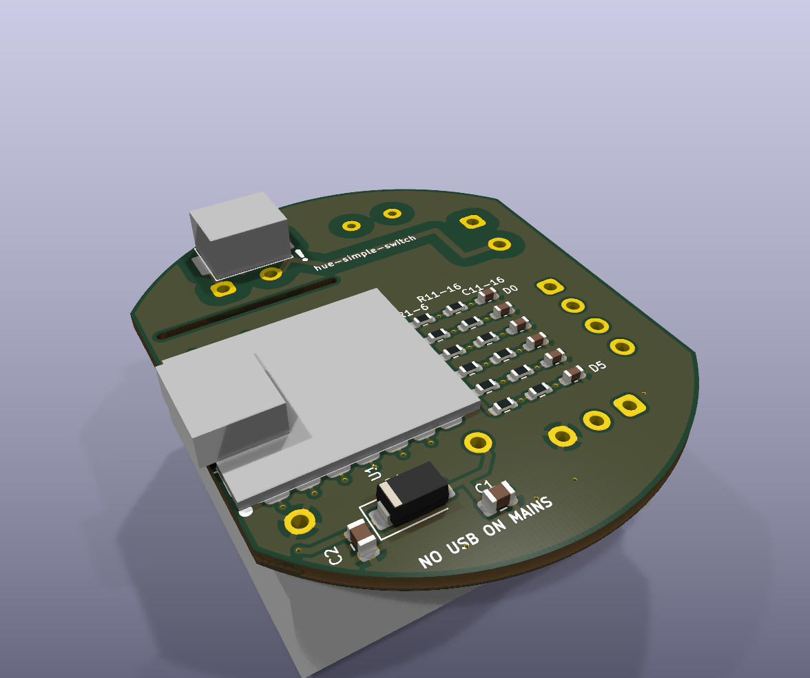
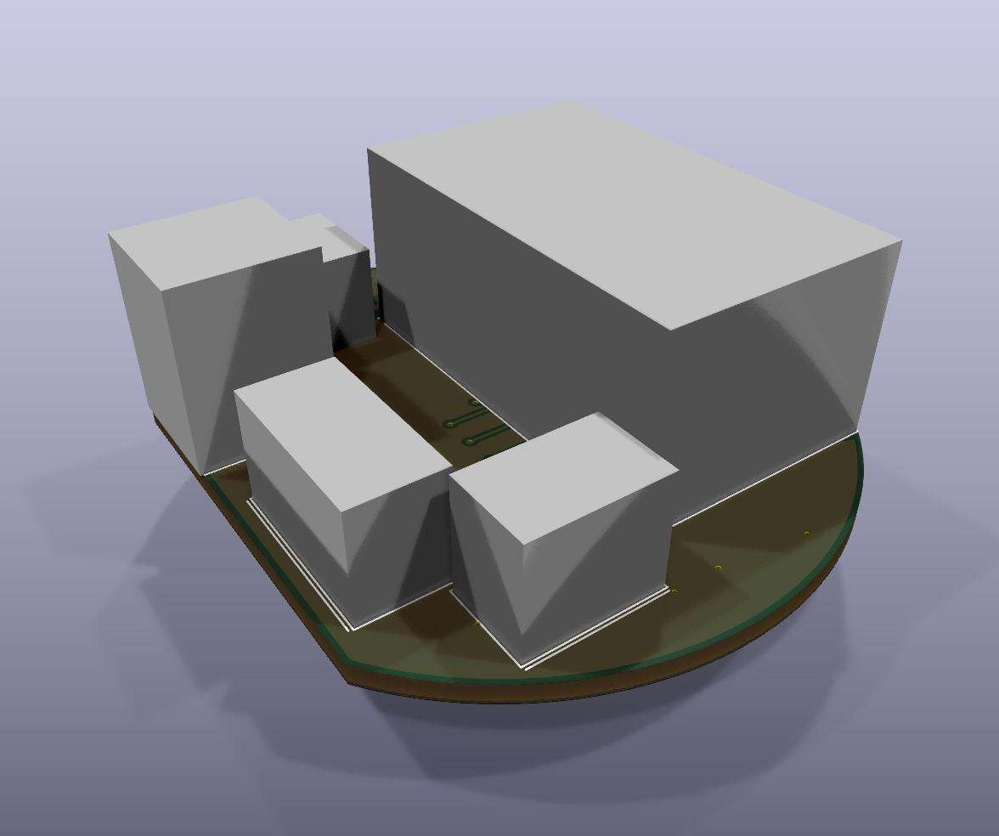
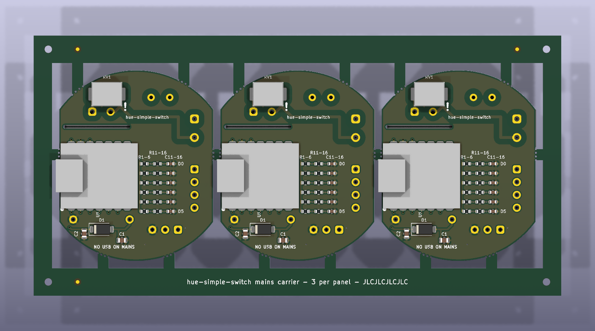

# Mains carrier board and enclosure

A small board that puts the XIAO ESP32-C6 and its own power supply inside a wall
electrical box, powered from the mains, reading the existing wall switches or
buttons on D0 to D5. Firmware, pin map and console contract are unchanged: this
is the same `hue-simple-switch`, with a different way to power and wire it.

> [!WARNING]
> **Mains voltage can kill.** This is an uncertified design, produced with AI
> assistance and checked only by the design-rule tools listed below. It has not
> been tested by a lab and carries no approval mark (CE, UL, SEC or other).
> Have a qualified electrician install it. Switch the circuit off at the
> breaker before opening the box, and check it is dead with a tester.
> Build and install it at your own risk.




The XIAO has no 3D model in these renders. It sits flat on the top side, USB-C
at the left edge.

## What is on the board

| Part | What it does |
| --- | --- |
| J1, 2-way 5.08 mm screw terminal | Mains in: L and N (up to 2.5 mm²) |
| F1, T500 mA TR5 fuse | Protects the wiring if the module or varistor fails |
| RV1, TDK SIOV CU3225 275 VAC SMD varistor (8.0 × 6.3 × 4.5 mm) | Clamps mains surges at the module input, after the fuse |
| PS1, Hi-Link HLK-PM01 | Certified, sealed, isolated 100-240 V AC to 5 V DC module (3 kV AC isolation) |
| D1, SS34 Schottky diode | Feeds the XIAO's 5V pin; stops a USB cable from powering the module backwards |
| U1, XIAO ESP32-C6 | Soldered flat by its edge pads |
| J2 + J3, 3.5 mm screw terminals | Wall switch inputs **D0 D1 D2 D3** and **D4 D5 GND**. Low voltage (3.3 V) only |
| R1-R6, R11-R16, C11-C16 | Each input: 10 kΩ pull-up at the pin, 1 kΩ in series, 10 nF at the terminal |

The pin map is the firmware's (see the repo [README](../README.md) and
[`docs/wiring-switches.svg`](../docs/wiring-switches.svg)): D0 to D5 are GPIO 0, 1,
2, 21, 22 and 23. A closed switch pulls its pin to GND. BOOT (hold 3 s to re-pair
with the Hue Bridge) and RESET are the XIAO's own buttons, reachable through the
window in the lid.

Isolation: everything connected to L or N is kept at least **6 mm** (clearance
and creepage, checked by DRC) from everything else. A routed slot under the
power module separates its AC pins from the XIAO. The only link between the two
sides is the HLK-PM01 itself.

Schematic: [`fab/hue-simple-switch-mains-schematic.pdf`](fab/hue-simple-switch-mains-schematic.pdf).

## Does it fit my box?

Enclosure outside: **46 × 56 mm, 26 mm tall** (a Ø56 mm disc with two sides cut
flat at 46 mm). It sits **behind the switch mechanism** in the same box, so the
box needs about 26 mm of free depth behind the mechanism.

| Box | Interior (typical) | Behind a mechanism |
| --- | --- | --- |
| EU round, Ø60 mm (DIN 49073) | Ø60 × 40 mm, or 60 to 65 mm deep | Deep box (≥ 60 mm) only. A standard 40 mm box is too shallow |
| US single gang | about 51 × 76 mm, 2.5 to 3.5 in deep | Yes, in most boxes |
| UK 86 × 86 (BS 4662) | 75 × 75 mm, 25, 35 or 47 mm deep | 47 mm box only |
| Chile, rectangular for Italian-style plates | about 50 × 95 mm, 40 to 50 mm deep | No room behind a mechanism, but it fits **beside** a 1-module mechanism, in the space of two blank modules (56 mm along the box) |

The Chilean dimensions come from retail listings, not a standard. Measure your
box: the width across the flats (46 mm) and the depth are what matter. In a
metal box, Wi-Fi range drops a lot; plastic boxes are better.

## Before you install: requirements

- **A neutral wire in the box.** The power module needs L and N. Many switch
  boxes (in Chile, and in older US and European homes) only have the switched
  live and the live feed, with no neutral. Without a neutral this board cannot
  be used. There is no safe no-neutral version for this design.
- **The Hue bulbs must be powered all the time.** The wall switch no longer
  switches the lamp; the lamp's live is joined straight through (as the
  existing Hue setup already requires).
- **The switch wires must be completely disconnected from the mains.** The
  wires that run from the box to each switch or button were mains wires. After
  the conversion they carry only 3.3 V from J2/J3. Every one of them must be
  disconnected from L, N and the lamp at both ends, and must go only to the
  switch and to J2/J3. If any of them still touches mains anywhere, the XIAO,
  and anyone touching its USB port, will be at mains voltage. An electrician
  must check this.

## Order assembled boards (JLCPCB)

JLCPCB assembles everything except the XIAO, on a panel of three boards.
All SMD parts are on the XIAO side (one-sided assembly); the power module, fuse
and terminals are through-hole on the other side.



1. At jlcpcb.com, upload
   [`fab/jlcpcb/hue-simple-switch-mains-panel-gerbers.zip`](fab/jlcpcb/hue-simple-switch-mains-panel-gerbers.zip).
   The panel is 144 × 71 mm (three boards, a frame with fiducials and tooling
   holes; each board held on six tabs with mouse bites: two on each round end
   and one on each straight side, so the row stays stiff during assembly). Defaults: 2 layers, 1.6 mm FR-4,
   1 oz copper, HASL. Choose **Panel by customer** (the frame is already there,
   so no edge rails or panelizing by JLCPCB) and quantity **5** = 15 boards.
2. Turn on PCB Assembly, top side, and upload
   [`fab/jlcpcb/hue-simple-switch-mains-panel-bom.csv`](fab/jlcpcb/hue-simple-switch-mains-panel-bom.csv)
   and [`fab/jlcpcb/hue-simple-switch-mains-panel-cpl.csv`](fab/jlcpcb/hue-simple-switch-mains-panel-cpl.csv).
   Designators end in the board number (`R1_1`, `R1_2`, `R1_3`). The XIAO (U1)
   is not in them. Add through-hole assembly for PS1, F1 and J1-J3.
3. In the preview, check the parts listed under [Check in JLCPCB's
   preview](#check-in-jlcpcbs-preview). The CPL gives each part's centre (the
   middle of its pads), so parts should sit on their pads; rotate any that do not.
4. Small SMD parts need a few spares for machine loss (attrition). JLCPCB takes
   the basic resistors and capacitors from its stock; for the varistor (an
   extended part) have a couple more than 15 in your parts inventory.

For hand assembly instead, the single board is in
[`fab/hue-simple-switch-mains-gerbers.zip`](fab/hue-simple-switch-mains-gerbers.zip)
with [`fab/hue-simple-switch-mains-bom.csv`](fab/hue-simple-switch-mains-bom.csv)
and [`fab/hue-simple-switch-mains-cpl.csv`](fab/hue-simple-switch-mains-cpl.csv).

### Check in JLCPCB's preview

Parts with a polarity or a direction that matters:

| Part | What must be right |
| --- | --- |
| D1, SS34 diode (top) | Cathode band towards pad 1, the left pad (towards C2 and the board's left edge). Reversed, the XIAO gets no power |
| PS1, HLK-PM01 (bottom) | The two pins 5 mm apart (AC) at the mains end, next to the fuse and RV1; the two pins 15.4 mm apart (DC) at the other end. The pin pattern only fits one way, so if the preview shows pins off the holes, rotate it until all four land |
| J1, J2, J3, screw terminals (bottom) | The wire openings face the board edge: J1 and J2 towards the straight right edge, J3 towards the round end. Turned 180° they still fit the holes but face inwards, so check this one by eye |
| U1, XIAO (you solder it) | Component side up, USB-C over the left board edge |

Not polarised: every resistor, the 10 nF and 22 µF ceramic capacitors, the
varistor RV1 and the fuse F1. They only need to sit on their pads.

When the panels arrive, snap the boards out at the mouse bites (bend each tab
towards the side without parts, or cut it with side cutters) and file the stubs
flush. Keep them clear of the mains parts: the tabs are at least 1 mm from any
mains copper.

## Solder the XIAO

1. **Flash and set up the XIAO over USB before you solder it** (next section).
   It is easier on its own, and afterwards the board should not be on USB at the
   same time as mains.
2. Solder it flat on the top side, USB-C over the left board edge. Solder all 14
   edge pads (only D0-D5, 5V, GND and 3V3 are used; the others hold it in
   place). Do not let solder bridge to the bare pads under the XIAO; the board
   has no copper under it.
3. Inspect the mains side with a magnifier: no solder balls, splashes or flux
   bridges between L, N and anything else. Trim the through-hole leads on the
   top side to 1.5 mm or less so they do not touch the lid.

## First setup (USB, never on mains)

Do this with the board **not connected to mains** (before soldering the XIAO,
or with J1 disconnected):

1. Flash and provision it over USB-C like any other hue-simple-switch: Chrome
   on [hue.tineira.com](https://hue.tineira.com) → Devices (see the main
   [README](../README.md)). Then pair the Hue Bridge.
2. Unplug USB.

After installation, updates come over Wi-Fi (firmware 0.6.0 and newer), so USB
is never needed in the wall.

> [!CAUTION]
> **Never connect a USB cable while the board is connected to mains.** The power
> module is isolated, but a fault, a wrongly wired switch line or a damaged
> module would put mains on the USB cable and on your computer.

## Wire it

```text
 mains L (permanent live) ── J1 L          Hue lamps: live joined straight through,
 mains N ─────────────────── J1 N          not through the switch any more

 switch 1 ── J2 D0     switch 4 ── J2 D3
 switch 2 ── J2 D1     switch 5 ── J3 D4
 switch 3 ── J2 D2     switch 6 ── J3 D5
 other terminal of every switch, joined ── J3 GND
```

- Use only the inputs you need, and set each one up in the console (toggle
  switch or push button).
- The common return of all switches goes to the single GND terminal: join them
  first with a lever connector (for example WAGO 221) and bring one wire to J3.
- The screw terminals take up to 2.5 mm² (J1) and about 1 mm² (J2/J3). For
  1.5 mm² solid building wire on J2/J3, join a short 0.5-0.75 mm² flexible
  pigtail with a lever connector.
- Keep the switch wires on the low-voltage side of the enclosure (wire holes on
  the long straight side next to D0-D3, and the curved end next to D4-GND). The
  L/N holes are the two larger ones at the other end of the straight side.
- Earth (PE): the module does not need it. Connect the box's earth wires to each
  other as before, not to this board.

## Print the enclosure

- [`enclosure/enclosure-base.stl`](enclosure/enclosure-base.stl) and
  [`enclosure/enclosure-lid.stl`](enclosure/enclosure-lid.stl), both already
  oriented flat side down. No supports.
- Plastic: **not PLA** (it softens and creeps in a warm wall box). Use PETG, ASA
  or PC; ideally a flame-retardant (UL 94 V-0) grade. 0.2 mm layers, 3 walls,
  100 % infill for the floor.
- The board rests on posts in the base (power module down); the lid clicks over
  it and its posts hold the board down. The terminal screws are reached through
  the slots in the base floor. Tighten the wires before closing the lid, and
  put a strip of Kapton or electrical tape over the floor slots before the
  module goes into the wall.
- Source: [`enclosure/enclosure.scad`](enclosure/enclosure.scad) (OpenSCAD,
  parametric: wall, clearances, heights, hole sizes). The board as a 3D model is
  in `enclosure/hue-simple-switch-mains-board.step` for checking the fit in a
  CAD tool.

Layout of the enclosure, seen from the lid (XIAO side):

```text
            ┌─── round end ───┐
           /  MAINS: F1, RV1   \
          │  (module AC pins)   │  J1: L, N  ◄── two Ø3.6 wire holes
  USB-C ◄─┤  XIAO     ··········├─ J2: D0-D3 ◄── four Ø3.0 wire holes
 + window │  (over the module)  │
           \   J3: D4 D5 GND   /
            └──── ▼ three Ø3.0 wire holes
```

## Regenerate the files

Everything in `kicad/`, `fab/`, `images/` and the STLs is generated from
[`scripts/design.py`](scripts/design.py) (parts, nets),
[`scripts/layout.py`](scripts/layout.py) (placement, copper) and
[`scripts/footprints.py`](scripts/footprints.py) (footprints and height models
for the power module, varistor and terminal blocks, drawn from each
manufacturer's datasheet; the numbers are quoted in the file). Edit those, not
the KiCad files, then run with KiCad 10's own Python:

```bash
"$LOCALAPPDATA/Programs/KiCad/10.0/bin/python.exe" hardware/scripts/build_all.py
```

It writes the schematic and runs ERC, builds the PCB, refills the copper pours
and runs DRC with schematic parity (it stops on any error), then exports the
Gerber zip, BOM, CPL, PDFs, STEP, renders, builds the 3-board panel
([`scripts/build_panel.py`](scripts/build_panel.py)) and checks it with DRC
too, exports its JLCPCB files into `fab/jlcpcb/`, and, when OpenSCAD is
installed, the STLs. Reports: `fab/erc.rpt`, `fab/drc.rpt` (the remaining warnings are
silkscreen clipped at the board edge, which the fab trims anyway). The custom
6 mm rule is in `kicad/hue-simple-switch-mains.kicad_dru`.

You can also open `kicad/hue-simple-switch-mains.kicad_pro` in KiCad 10 to look
around; changes made there are lost at the next regeneration.

## Credits and licenses

- XIAO ESP32-C6 footprint: from Seeed Studio's
  [OPL_Kicad_Library](https://github.com/Seeed-Studio/OPL_Kicad_Library)
  (CC BY-SA 4.0), reduced to the 14 edge pads in `kicad/lib/XIAO.pretty`.
- Other symbols, footprints and 3D models: the KiCad libraries (CC BY-SA 4.0
  with the KiCad libraries exception).
- The board design itself is MIT, like the rest of this repository.
